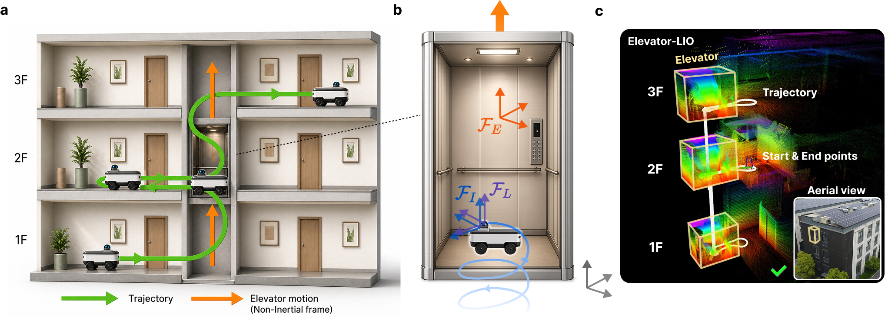
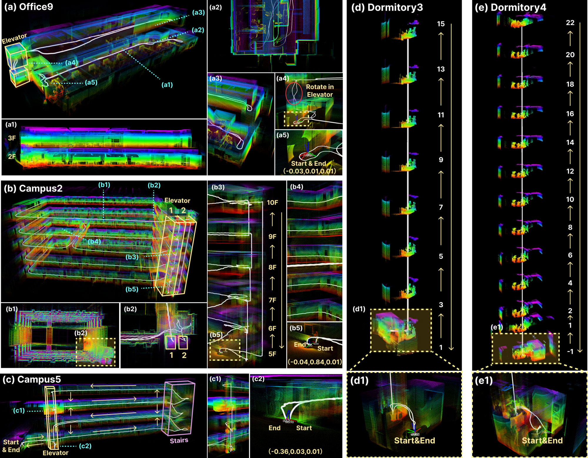
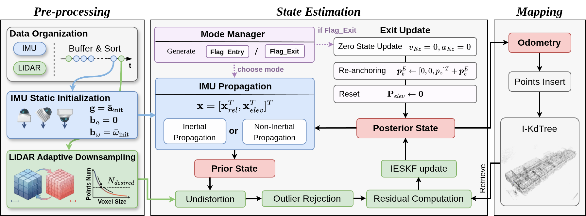
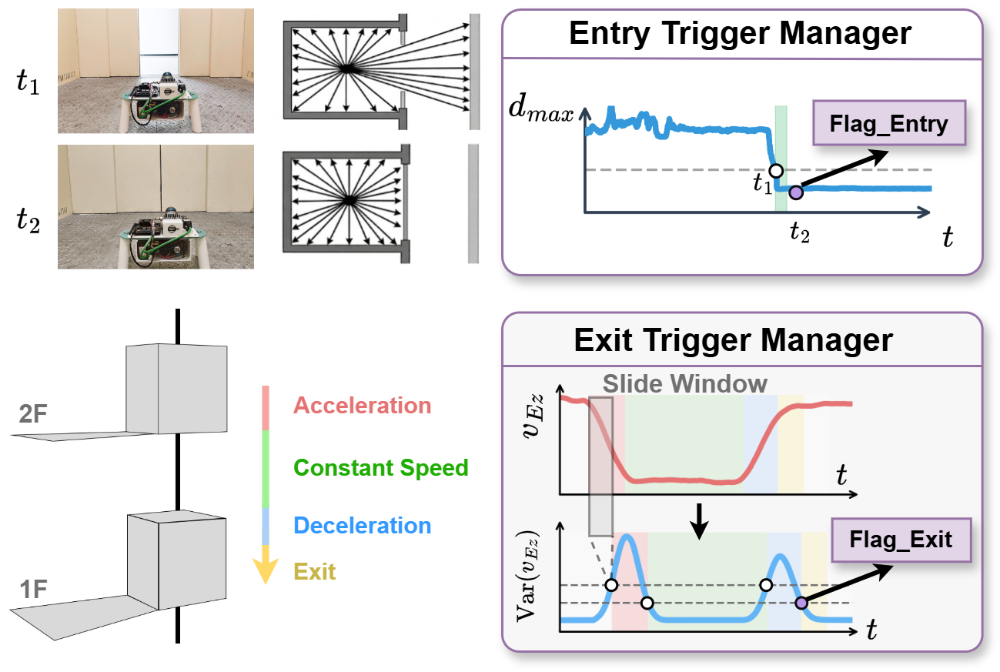
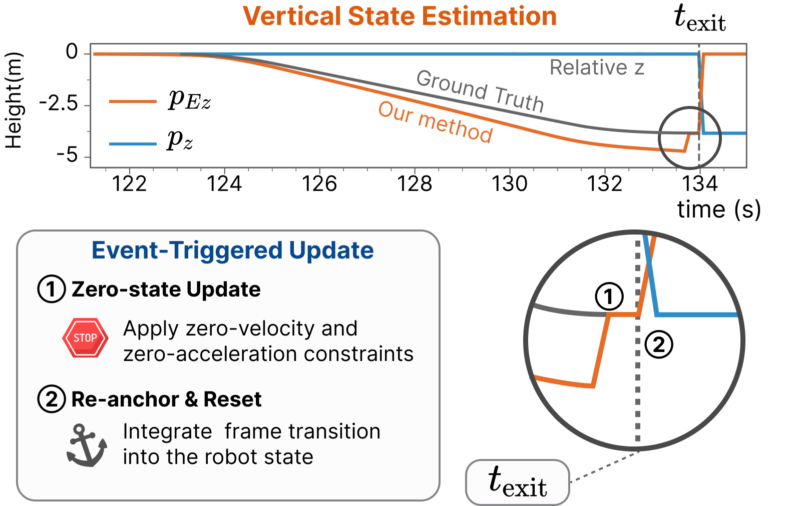
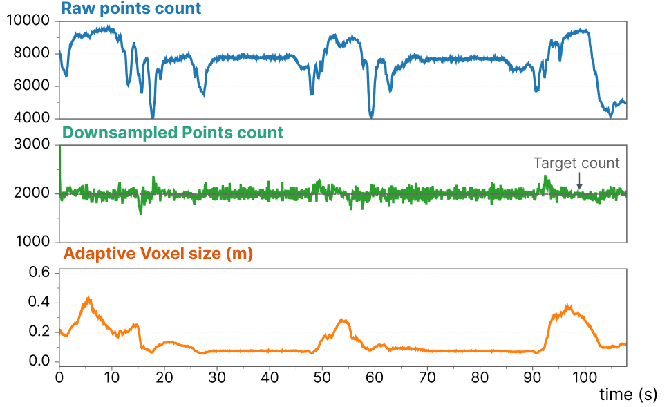
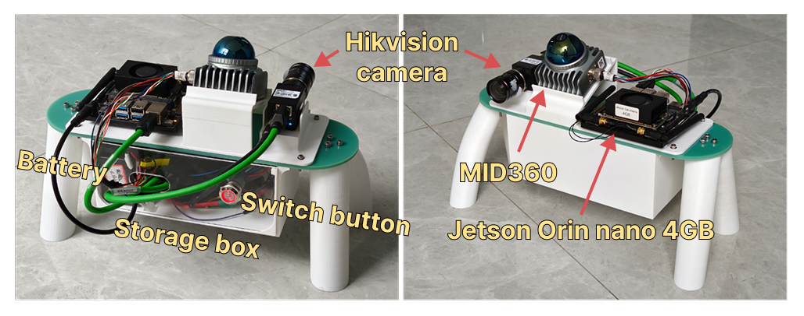

# Elevator-LIO

[中文](README.md) | [English](README_en.md)

Elevator-LIO 是面向电梯非惯性运动和跨楼层定位的 LiDAR-惯性里程计。主要测试平台为 Livox MID-360，同时支持其他雷达如 Ouster、Velodyne、XT32 等，但除MID360外尚未经过大规模测试。


[](https://xiaofan4122.github.io/Elevator_LIO_Page/)
[](https://arxiv.org/abs/2605.24495)
[](https://huggingface.co/datasets/xiaofan0100/Elevator-LIO-Dataset)

数据集下载与使用说明见 [DATASET.md](DATASET.md)。

关闭 YAML 中的电梯模式后，Elevator-LIO 可作为普通 LIO 使用，并保留触发式更新和自适应降采样等功能。

<p align="center">
  
</p>

> [!WARNING]
> Elevator-LIO 允许机器人在电梯内自由移动，但建议使用 Livox MID-360 这类视场较大的 LiDAR，并采用倾斜安装，以获得尽可能多方向上的几何约束。如果您的 LiDAR 水平安装，且机器人在电梯内基本不会产生上下运动，请将 `yaml/runtime` 中的 `elevator.strong_prior_enable` 设置为 `true`。该选项会将 IMU 垂直方向加速度强约束解释为电梯加速度，使系统在此类安装条件下也能正常工作。

## 时间节点

- **2026-05-23**：[arXiv 预印本](https://arxiv.org/abs/2605.24495)公开。
- **2026-05-26**：[小红书](http://xhslink.com/o/9MTzcbzjGaQ) 公开宣传。
- **2026-06-06**：[@编程猫小渐](http://xhslink.com/o/5bhSpWqEbeO) 复现 Elevator-LIO 论文结果。
- **2026-06-20**：[Elevator-LIO 数据集](https://huggingface.co/datasets/xiaofan0100/Elevator-LIO-Dataset)公开，包含 20 条序列和 79 次电梯乘坐；额外收录 @编程猫小渐 的两条数据。
- **2026-06-22**：发布 [rosbag 管理器视频](https://www.bilibili.com/video/BV1n3jt64Eoi/?share_source=copy_web&vd_source=392db04838f1edf7d12e58a3d68775d8)，该工具随 Elevator-LIO 一同开源。
- **2026-06-26**：ROS 1 源码发布。
- **计划中**：ROS 2 源码发布。
- **计划中**：更多数据集发布，包括更多带图像的完整序列。
- **计划中**：手持采集平台软硬件源码与文档公开。

## 场景展示



## 方法概述

传统 LIO 假设导航坐标系为惯性系，但在运动的电梯轿厢内，IMU 会感受到电梯运动，而 LiDAR 主要观测轿厢内的相对几何，现有 LIO 方法几乎全部失效。Elevator-LIO 将机器人相对电梯的运动与电梯自身运动解耦，并通过模式相关的迭代误差状态卡尔曼滤波实现连续跨楼层定位：普通室内环境使用标准 LIO 传播，进入电梯后启用非惯性状态传播和约束更新。



系统按照时间顺序处理 IMU 和 LiDAR 数据，依次完成静态 IMU 初始化、自适应降采样、模式相关传播、IESKF LiDAR 更新、可能的退出电梯更新和增量 ikd-Tree 建图。

### 电梯模式管理

进入检测使用 LiDAR 距离统计量判断机器人是否由开放区域进入封闭轿厢；退出检测根据估计的电梯竖直运动状态及其方差判断电梯是否停稳。两种事件也可以通过 ROS 话题手动触发。

<p align="center">
  
</p>

### 退出电梯更新

电梯停稳后，系统施加零速度和零加速度约束，将估计的电梯竖直位移重新锚定到机器人状态，并重置电梯相关状态，从而抑制电梯运行期间累积的高度漂移。

<p align="center">
  
</p>

### 自适应降采样

系统在线调整体素大小，使降采样后的有效点数保持在目标值附近，在电梯轿厢内保留足够的几何信息，同时控制开放场景中的计算量。

<p align="center">
  
</p>

## 数据采集平台

<p align="center">
  
</p>

数据使用集成 Livox MID-360、工业相机和 Jetson Orin Nano 的便携式手持设备采集。

> [!NOTE]
> - [ ] 后续将开源手持设备的软硬件设计与相关文档。
>

## 🔥 设计理念

Elevator-LIO 的设计遵循开箱即用的原则，集成了许多便于使用的功能，具有完善的注释方便您进行后续开发，日志与调试系统比较完善。

小巧思包括：

- **无 Livox_ros_driver 依赖**：自定义消息在包内构建，在 ROS 系统上可直接编译使用
- **初始重力对齐**：无论雷达以何种方向放置，世界系都会初始化为水平方向
- **球形/长方体包围盒滤除**：除了指定球形滤除框，也可以指定长方体区域内点云滤除
- **预留额外的 body 系输出**：可在 yaml/sensors 中配置 `lidar_R_vehicle` 和 `lidar_t_vehicle`
- **简单的重定位功能**：支持加载 PCD 地图，然后在原点启动并运行重定位
- **协方差矩阵可视化**：可在 yaml/logging 中打开，方便调试
- **高频输出**：可在 yaml/runtime 中打开，将IMU预积分位姿也输出出来，方便下游应用

不同于主流 LIO，Elevator-LIO 没有显式打包概念，遵循“谁来谁更新”的设计理念，在框架上更适合多传感器融合；但这也带来了额外开销：状态机需要以较高频率轮询并检测是否有数据输入。


## 🛠️ 安装与运行

### 环境要求

当前代码主要在以下环境中开发和测试：

- Ubuntu 20.04
- ROS Noetic

OpenCV 目前只用于协方差矩阵和电梯状态曲线的调试窗口，默认配置中这些窗口均关闭；但源码和 CMake
仍会包含并链接 OpenCV，您可以自行修改代码取消这些依赖。

### 编译

将代码放入 `src` 目录下编译：

```bash
catkin_make
```

### 运行

直接使用 `roslaunch` 运行：

```bash
roslaunch lio start.launch
```

可以指定对应的 YAML 文件参数。默认配置为 `root_config.yaml`，也可以创建自己的配置文件：

```bash
roslaunch lio start.launch config_path:=path_to_yaml
```


### 电梯模式说明

电梯功能由统一开关控制：

```yaml
elevator:
  enable: true
```

自动进入电梯模式由门关闭检测控制：

```yaml
elevator:
  door_detector:
    enable: true
```

该检测基于点云距离分位数，在狭窄场景（如楼道）中可能误触发。可以关闭自动检测，改用话题手动触发。

进入电梯模式（通过话题触发）：

```bash
rostopic pub /LIO/set_elevator_flag std_msgs/Bool "data: true" -1
```

退出电梯模式（通过话题触发）：

```bash
rostopic pub /LIO/set_elevator_flag std_msgs/Bool "data: false" -1
```

自动退出通过下面参数控制：

```yaml
elevator:
  self_exit_detector: true # 打开时会根据估计出的电梯速度及其方差信息，自动退出电梯模式
```

程序内部的电梯状态会和 LiDAR 信息同频率发布：`/LIO/in_elevator` 保留布尔模式标志；`/LIO/elevator_state` 发布电梯模式以及估计的相对位移、速度和加速度，并供 RViz 电梯状态面板显示。

### 仿真节点

在程序开发早期，我们设计了仿真节点 `sim_node`，用于构造电梯场景并生成 LiDAR 与 IMU 消息。具体程序与配置位于 `src/sim` 中。

### 参数修改

在 `root_config.yaml` 中分别选择传感器、运行和日志配置：

```yaml title: root_config.yaml

sensor_config: "sensors/livox.yaml"
runtime_config: "runtime/mapping.yaml"
logging_config: "logging/default.yaml"
```

详细说明见 [yaml/README.md](yaml/README.md)。

部分关键配置：

- **降采样参数**。如在嵌入式设备上无法实时运行，可以增大 `point_filter_num`、降低
  `adaptive.target_points`，或增大 `adaptive.min_voxel`：

```yaml
downsample:
  point_filter_num: 2 # 订阅点云时的降采样比例 [确保为正整数]
  blind: 0.8 # 忽略距离小于 blind 的点 [m]
  use_box_blind: false # true 时改为删除下述长方体内的点
  box_corner: # LiDAR 坐标系下的三轴范围 [min, max]，单位 m
    box_corner_x: [-0.7, 0.1]
    box_corner_y: [-0.3, 0.3]
    box_corner_z: [-0.4, 0.4]
  filter_size: 0.1 # 固定模式的体素大小；自适应模式下的初始体素大小
  adaptive:
    enable: true # 启用自适应体素降采样
    target_points: 20000 # 目标每秒点数（程序会按帧时间折算）
    alpha: 1.2 # 幂律调节指数
    min_voxel: 0.05 # 最小体素大小
    max_voxel: 0.8 # 最大体素大小
```

- **电梯功能配置**。关闭 `elevator.enable` 后，系统会退化为普通 LIO；开启时可使用 LiDAR 门关闭检测自动进入电梯模式，并通过 IMU 运动状态自动退出：

```yaml
elevator:
  enable: true # 电梯模式总开关
  self_exit_detector: true # 根据 IMU 电梯运动阶段与停稳检测自动退出
  door_detector:
    enable: true # 是否启用电梯门关闭自动检测
    dist_threshold: 3.0 # 过滤后最远点小于该距离时认为轿厢封闭 [m]
    time_threshold: 2.0 # 封闭状态持续多久后触发电梯模式 [s]
    filter_percent: 0.06 # 计算最远距离时忽略最远端点的比例
    cooldown_time: 5.0 # 两次自动触发之间的冷却时间 [s]
  zupt:
    enable: true # 电梯相关 ZUPT 总开关
    waiting:
      enable: true # 进入电梯后的等待阶段是否周期性触发 ZUPT
      period_s: 3.0
      vz_abs_thresh: 0.1
      az_abs_thresh: 0.1
  exit_icp_z:
    enable: false # 退出电梯后是否用已有 ikd-tree 地图做仅 z 方向 ICP 修正
```

> [!WARNING]
> 电梯退出检测相对稳定，但自动进入检测在狭窄走廊等封闭环境中可能误触发。您可以根据场景调整 `door_detector` 相关阈值，或自行发布触发信号；话题触发方式请参考上方“电梯模式说明”中的通过话题触发小节。重定位配置中默认开启 `exit_icp_z.enable`，建图配置中默认关闭，详细参数见 [yaml/README.md](yaml/README.md)。

- **重定位设置**，启用重定位时记得修改参考地图文件

```yaml
relocation:
  relocation_enable: false # 是否开启重定位
  pcd_load_name: "scans.pcd" # 重定位时加载的 .pcd 文件名称，相对 PCD 文件夹
```

## 目录结构

每次建图结束后，地图都会保存到 `PCD` 文件夹下。

日志文件会生成在新建的 `Temp` 文件夹下。

核心代码位于 `src` 和 `include` 文件夹下。

`temp` 文件夹下会生成当前批次运行得到的一些关键数据记录。


```text
├── CMakeLists.txt
├── PCD                         # 建图结果、重定位地图和临时点云
│   └── Temp                    # 运行过程中生成的临时点云
├── docs                        # README 使用的说明文档与资源
│   └── images                  # 项目图片、流程图和效果图
├── include                     # C++ 头文件
│   ├── support                 # 公共类型、配置读取、缓存和节点接口
│   │   ├── common_lib.h
│   │   ├── LIONode.h
│   │   ├── SharedBuffers.h
│   │   ├── TopicProcess.h
│   │   ├── YamlReader.*
│   │   └── type.h
│   ├── elevator                # 电梯检测、状态机和 ZUPT 接口
│   │   ├── ElevatorProcess.h
│   ├── estimator               # ESEKF 与 IMU 预积分/传播接口
│   │   ├── ESEKF.h
│   │   └── IMUProcess.h
│   ├── AdaptiveFilter          # 自适应体素降采样
│   │   ├── AdaptiveVoxelFilter.hpp
│   │   └── AdaptiveVoxelPController.hpp
│   ├── ikd_tree                # 增量式 ikd-tree 地图与近邻查询
│   │   ├── IkdMap.hpp
│   │   ├── IkdNearestQuery.hpp
│   │   └── ikd_Tree.*
│   ├── node                    # LiDAR 处理流水线等节点内部接口
│   └── rviz                    # 算法调试可视化接口
├── launch                      # ROS 节点启动文件
│   └── start.launch
├── msg                         # 项目自定义 ROS 消息
│   └── *.msg
├── package.xml
├── README.md
├── README_en.md
├── rviz                        # RViz 显示配置
│   └── LIO.rviz
├── scripts                     # Bag Runner、数据分析和绘图脚本
│   └── bag_runner_ui.py
├── src                         # C++ 源码实现
│   ├── main.cpp
│   ├── elevator                # 电梯检测、状态机和 ZUPT 实现
│   │   └── ElevatorProcess.cpp
│   ├── estimator               # ESEKF 与 IMU 处理实现
│   │   ├── ESEKF.cpp
│   │   └── IMUProcess.cpp
│   ├── node                    # ROS 回调、地图、发布、保存和服务
│   │   ├── callbacks.cpp
│   │   ├── map.cpp
│   │   ├── publish.cpp
│   │   ├── save.cpp
│   │   └── service.cpp
│   ├── rviz                    # rviz 配置文件
│   ├── support                 # 公共配置、日志和话题接收实现
│   │   ├── common_lib.cpp
│   │   └── TopicReceive.cpp
│   └── sim                     # 仿真节点
│       └── run_sim_node.cpp
├── yaml                        # 分层运行配置
│   ├── root_config.yaml
│   ├── sensors                 # 雷达类型、外参和订阅话题
│   ├── runtime                 # 建图、重定位、估计器和电梯参数
│   └── logging                 # 控制台、文件日志和调试可视化
```

## 引用

使用本软件或数据集时，请引用 Elevator-LIO 论文：

```bibtex
@misc{zhang2026elevatorlio,
      title={Elevator-LIO: Robust LiDAR-Inertial Odometry for Multi-Floor Navigation under Elevator-Induced Non-Inertial Motion}, 
      author={Yifan Zhang and Yudong Huang and Yuchong Zhang and Changze Li and Haoran Liu and Ming Yang and Tong Qin},
      year={2026},
      eprint={2605.24495},
      archivePrefix={arXiv},
      primaryClass={cs.RO},
      url={https://arxiv.org/abs/2605.24495}, 
}

```

## 许可证

本项目整体以 [GNU General Public License v2.0 or later](LICENSE) 发布。仓库包含的独立 MIT 组件继续保留各自文件头中的 MIT 标识；第三方代码及修改说明见 [THIRD_PARTY.md](include/ikd_tree/THIRD_PARTY.md)。
